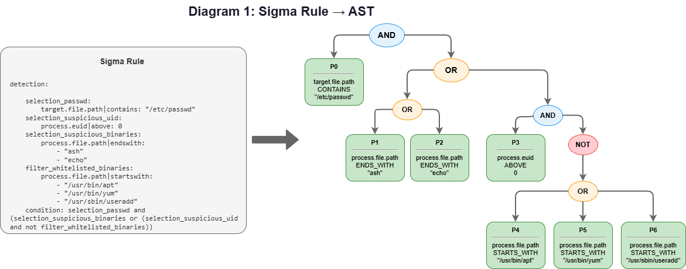
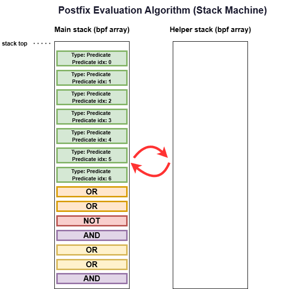

# From YAML to Kernel Enforcement: Building a Sigma Rules Engine with eBPF LSM

How we compiled Sigma Rules into a stack-based expression evaluator running inside the Linux kernel.

---

## Introduction

Sigma Rules look deceptively simple. A YAML file with some field names, a few string matches, and a condition like<br> `selection and not filter`. Easy to read. Easy to write.

But try evaluating that logic inside an eBPF LSM hook — where you're on the critical path of different syscalls and need to make a block/allow decision as efficiently as possible — and things get complicated fast.

Consider what a real Sigma Rule condition can look like:

```
# See full rule below

condition: selection_passwd and (selection_suspicious_binaries or (selection_suspicious_uid and not filter_whitelisted_binaries))
```

That's nested boolean logic with ANDs, ORs, NOTs, and parentheses. Each `selection_*` expands into multiple field comparisons — string contains, starts-with, numeric comparisons. The full expression tree can have dozens of nodes.

Now try running that inside the eBPF verifier's constraints: no recursion, no unbounded loops, 512-byte stack limit, and every memory access must be bounds-checked. Traditional expression evaluation techniques don't work here.

This post describes how we solved it in [owLSM](https://github.com/Cybereason-Public/owLSM), an open-source stateful Sigma Rule Engine implemented via eBPF LSM. The pipeline compiles Sigma Rules into a kernel-evaluable format that runs in under a microsecond per syscall.

---

## The Problem: A Concrete Example

Let's trace a specific rule through the entire pipeline. This rule blocks unauthorized write attempts to `/etc/passwd`:

```yaml
# More sigma metadata ...

description: "Block unauthorized /etc/passwd modifications"
action: "BLOCK_EVENT"
events:
    - WRITE
detection:
    
    selection_passwd:
        target.file.path|contains: "/etc/passwd"
    selection_suspicious_uid:
        process.euid|gt: 0
    selection_suspicious_binaries:
        process.file.path|endswith:
            - "ash"
            - "echo"
    filter_whitelisted_binaries:
        process.file.path|startswith:
            - "/usr/bin/apt"
            - "/usr/bin/yum"
            - "/usr/sbin/useradd"
    condition: selection_passwd and (selection_suspicious_binaries or (selection_suspicious_uid and not filter_whitelisted_binaries))
```

The rule combines:
- 1 substring search (`contains`)
- 2 suffix matches (`endswith`)
- 3 prefix matches (`startswith`)
- 1 numeric comparison (`gt`)
- Nested ANDs, ORs, and a NOT

This needs to evaluate inside a kernel hook. Here's how we made it work.

---

## Stage 1: Parsing — Sigma Rule to AST

### AST Construction via pySigma

The detection logic is parsed into an Abstract Syntax Tree (AST) using [pySigma](https://github.com/SigmaHQ/pySigma), the official Sigma rule processing python library. We implemented a custom pySigma Backend that, extracts data from the AST and builds tables that will later be converted to bpf maps.

<br>

Each leaf node in the AST is an atomic **predicate** — a single field comparison:

| Predicate | Field | Comparison | Value |
|-----------|-------|------------|-------|
| P0 | `target.file.path` | CONTAINS | "/etc/passwd" |
| P1 | `process.file.path` | ENDS_WITH | "ash" |
| P2 | `process.file.path` | ENDS_WITH | "echo" |
| P3 | `process.euid` | ABOVE | 0 |
| P4 | `process.file.path` | STARTS_WITH | "/usr/bin/apt" |
| P5 | `process.file.path` | STARTS_WITH | "/usr/bin/yum" |
| P6 | `process.file.path` | STARTS_WITH | "/usr/sbin/useradd" |

Notice how Sigma's structure maps to boolean logic:
- Multiple values for one field → OR (e.g., the `endswith` list under `selection_suspicious_binaries`)
- Multiple fields within a selection → AND
- `not` keyword → NOT node

### Building the Lookup Tables

As pySigma walks the detection section, we build three deduplicated lookup tables:

<div style="display: flex; gap: 30px; flex-wrap: wrap;">

<div>
<strong><code>id_to_string</code></strong><br>
<em>The "Is Contains" flag marks strings needing<br>
KMP DFA pre-computation for substring search.<br>
*Ignore for now*</em>

| ID | Value | Is Contains |
|----|-------|-------------|
| 0 | "/etc/passwd" | true |
| 1 | "ash" | false |
| 2 | "echo" | false |
| 3 | "/usr/bin/apt" | false |
| 4 | "/usr/bin/yum" | false |
| 5 | "/usr/sbin/useradd" | false |

</div>

<div>
<strong><code>id_to_predicate</code></strong><br>
<em>Field comparisons referencing strings/numbers</em><br>  <br>  <br>

| ID | Field | Type | Reference |
|----|-------|------|-----------|
| 0 | target.file.path | CONTAINS | str: 0 |
| 1 | process.file.path | ENDS_WITH | str: 1 |
| 2 | process.file.path | ENDS_WITH | str: 2 |
| 3 | process.euid | ABOVE | num: 0 |
| 4 | process.file.path | STARTS_WITH | str: 3 |
| 5 | process.file.path | STARTS_WITH | str: 4 |
| 6 | process.file.path | STARTS_WITH | str: 5 |

</div>

<div>
<strong><code>id_to_ip</code></strong><br>
<em>IP addresses with CIDR masks<br>
(not used in this example)</em><br> <br>

| ID | IP | CIDR | Type |
|----|----|------|------|
| — | — | — | — |

</div>

</div>
<br>

Predicates, strings and IP addresses are **deduplicated** across rules. If 10 different rules all check `target.file.path contains "/etc/passwd"`, that predicate and "/etc/passwd" are stored once and referenced by index everywhere. This deduplication is critical — it reduces kernel memory and enables predicate result caching.

---
<br>

## Stage 2: Transformation — AST to Postfix (Reverse Polish Notation)

We need to evaluate the AST inside eBPF, but:

- **No recursion** — the verifier forbids it
- **No call stack** — we can't traverse a tree with function calls. 
- **512-byte stack limit** — we can't store arbitrary nested structures. Verifier limitation.

The solution: **convert the AST to postfix notation** (Reverse Polish Notation). Postfix expressions can be evaluated with a single linear pass using a fixed-size stack — no recursion, no operator precedence logic, no parentheses needed at evaluation time.

We use **infix-to-postfix conversion** via tree traversal. The specific traversal order is determined by the pySigma backend implementation.

Our example rule produces this postfix sequence:

```
P0 P1 P2 P3 P4 P5 P6 OR OR NOT AND OR OR AND
```

### Tokenization

Each element in the postfix sequence is converted to a **token** — a small struct containing:
- `operator_type`: PREDICATE, AND, OR, or NOT
- `predicate_idx`: (only for PREDICATE tokens) index into the predicate table


### Serialization to JSON

The lookup tables and token arrays are serialized into JSON:

```json
{
  "id_to_string": {
    "0": { "value": "/etc/passwd", "is_contains": true },
    "1": { "value": "ash", "is_contains": false },
    "2": { "value": "echo", "is_contains": false },
    "3": { "value": "/usr/bin/apt", "is_contains": false },
    "4": { "value": "/usr/bin/yum", "is_contains": false },
    "5": { "value": "/usr/sbin/useradd", "is_contains": false }
  },
  "id_to_predicate": {
    "0": { "field": "target.file.path", "comparison_type": "contains", "string_idx": 0 },
    "1": { "field": "process.file.path", "comparison_type": "endswith", "string_idx": 1 },
    "2": { "field": "process.file.path", "comparison_type": "endswith", "string_idx": 2 },
    "3": { "field": "process.euid", "comparison_type": "above", "numerical_value": 0 },
    "4": { "field": "process.file.path", "comparison_type": "startswith", "string_idx": 3 },
    "5": { "field": "process.file.path", "comparison_type": "startswith", "string_idx": 4 },
    "6": { "field": "process.file.path", "comparison_type": "startswith", "string_idx": 5 }
  },
  "id_to_ip": {},
  "rules": [
    {
      "id": 42,
      "description": "Block unauthorized /etc/passwd modifications",
      "action": "BLOCK_EVENT",
      "applied_events": ["WRITE"],
      "tokens": [
        { "operator_type": "OPERATOR_PREDICATE", "predicate_idx": 0 },
        { "operator_type": "OPERATOR_PREDICATE", "predicate_idx": 1 },
        { "operator_type": "OPERATOR_PREDICATE", "predicate_idx": 2 },
        { "operator_type": "OPERATOR_PREDICATE", "predicate_idx": 3 },
        { "operator_type": "OPERATOR_PREDICATE", "predicate_idx": 4 },
        { "operator_type": "OPERATOR_PREDICATE", "predicate_idx": 5 },
        { "operator_type": "OPERATOR_PREDICATE", "predicate_idx": 6 },
        { "operator_type": "OPERATOR_OR" },
        { "operator_type": "OPERATOR_OR" },
        { "operator_type": "OPERATOR_NOT" },
        { "operator_type": "OPERATOR_AND" },
        { "operator_type": "OPERATOR_OR" },
        { "operator_type": "OPERATOR_OR" },
        { "operator_type": "OPERATOR_AND" }
      ]
    }
  ]
}
```

This JSON becomes part of the configuration passed to the userspace component at startup.<br>
Now we will see how the userspace component deserializes the json and uses it to populate bpf maps.

---

## Stage 3: Pre-computation — Userspace Preparation

Before anything reaches the kernel, the userspace component (C++) loads the JSON and pre-computes everything it can.

### The KMP DFA for Substring Search

The `CONTAINS` comparison needs substring search. The naive O(n×m) approach is too slow for inline syscall evaluation. KMP (Knuth-Morris-Pratt) gives us O(n), but standard KMP uses a failure function with conditional branches — problematic in eBPF where we want predictable execution.

We build a **complete DFA transition table** — a 2D array where `dfa[state][character]` gives the next state directly. No conditionals, no failure-function chasing.

For the pattern "/etc/passwd", the DFA has states 0 through 11 (pattern length), and each state has 256 entries (one per possible byte value). Reaching the final state means the pattern was found.

The trade-off is memory: each DFA is a fixed `256 × 256` byte array. This is a significant memory cost, but the guarantee of worst-case O(n) substring functionality which is verifier friendly, is worth it for inline syscall evaluation.

### Event-Type Rule Maps

Rules are stored in **per-event-type bpf arrays**. A rule with `events: [WRITE]` is only inserted into `write_rules`. When a WRITE syscall fires, the kernel iterates *only* over `write_rules` — never touching READ, EXEC, or NETWORK rules.

A rule can specify multiple event types (e.g., `events: [CHMOD, CHOWN, READ, WRITE]`) and will be inserted into all relevant maps. We won't expand on multi-event rules in this post.

### BPF Map Population

After pre-computation, userspace populates the BPF maps:
- `predicates_map` — Global predicate table. equivalent to id_to_predicate.
- `rules_strings_map` — String values with length and DFA index. equivalent to id_to_string.
- `idx_to_DFA_map` — Pre-computed KMP DFAs for `contains` strings
- `rules_ips_map` — IP addresses in binary form with CIDR masks. equivalent to id_to_ip.
- `{event}_rules` — Per-event-type rule arrays 
- `predicates_results_cache` — Predicate result cache (per-CPU)

After populating the maps, the userspace attaches the eBPF probes.

---

## Stage 4: Kernel Evaluation — The Stack Machine

When a WRITE syscall fires, the eBPF hook runs.

### Event Population

First, the hook populates an event struct with all relevant context:  
`target.file.path` = "/etc/passwd",  `process.euid` = 1000  and dozens of other event fields.    
The event timestamp is also captured here — this becomes important for `predicates_results_cache`.

### Stack-Based Postfix Evaluation

We use the **reverse Polish notation evaluation algorithm**. This is the standard algorithm for evaluating postfix expressions — it's O(n) in the number of tokens and requires only 2 small fixed-size stacks.  
We implemnted the stacks using bpf arrays. Implementing `top`, `pop`, `push`, `empty` functions.

<br>

After processing all tokens, the stack contains exactly one value: the final result.

### Predicate Lookup and Evaluation

When we need to evaluate a PREDICATE token, we:
1. Read `predicate_idx` from the token
2. Check if its in the `predicates_results_cache`
3. Look up the predicate struct from `predicates_map[predicate_idx]`
4. Dispatch based on comparison type: string, numeric or IP comparison.
5. store the result in `predicates_results_cache`

### Predicate Result Caching

The same predicate often appears in multiple rules. Without caching, we'd evaluate `target.file.path contains "/etc/passwd"` once per rule — potentially dozens of times.  
We maintain a `predicates_results_cache` per-CPU BPF hash map. But how do we invalidate it between events without expensive cleanup?

**Timestamp-based invalidation:** Each cache entry stores the event timestamp alongside the result. When checking the cache:
- If the stored timestamp matches the current event's timestamp → cache hit, return stored result
- If timestamps differ → cache miss, evaluate and store with new timestamp

This works because:
1. The event timestamp is captured during event population (Stage 4)
2. The cache is a **per-CPU map** — no cross-CPU interference
3. eBPF programs are **non-preemptible** — once an event starts processing on a CPU, it runs to completion before any other event on that CPU

This guarantees that within a single event, all cache lookups see consistent timestamps. When the next event arrives, it has a higher timestamp, automatically invalidating all previous entries without any explicit cleanup.

```c
cached_result = get_cached_result(predicate_idx, current_event_timestamp);
if (cached_result != UNKNOWN)
    return cached_result;

result = evaluate_predicate(predicate_idx, event);
cache_result(predicate_idx, result, current_event_timestamp);
return result;
```

### First Match Wins

Rules are stored sorted by ID (lowest first). When a rule matches, evaluation stops immediately — Rule 1 is evaluated before Rule 100.  
This differs from most Sigma Rules Engines that always evaluate all rules and aggregate results. For inline enforcement where microseconds matter, early exit is critical.

---


## What We Left Out

This post focused on the core algorithm chain. We explicitly didn't cover many things like: fieldref, keywords, IP matching, and many more cool features.  
Let me know if you'd like to hear about how we solved these.